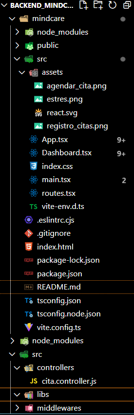
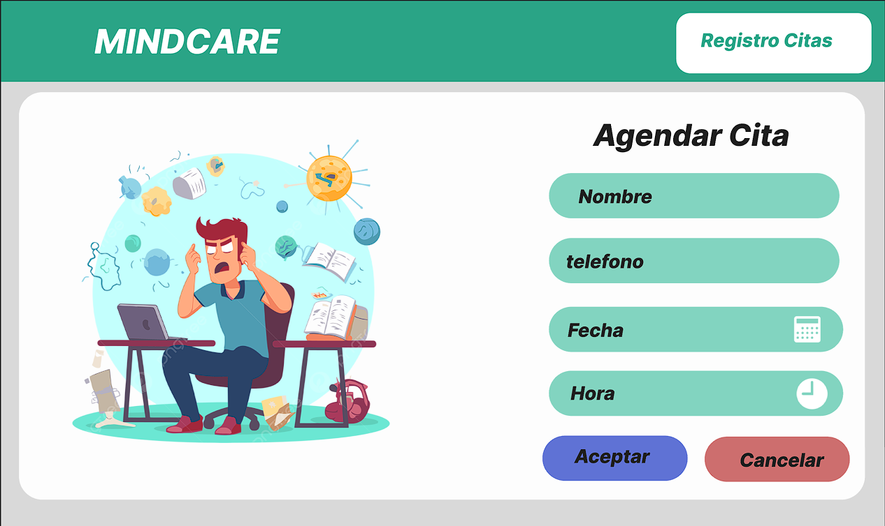
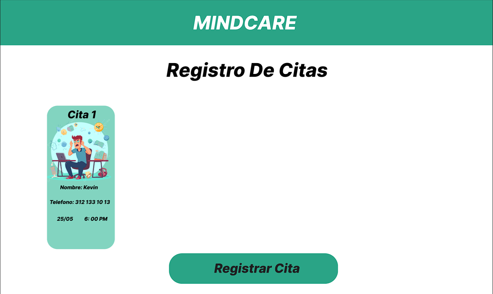
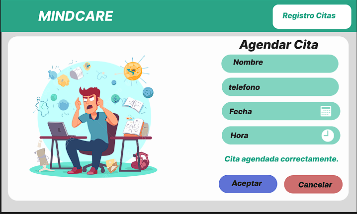
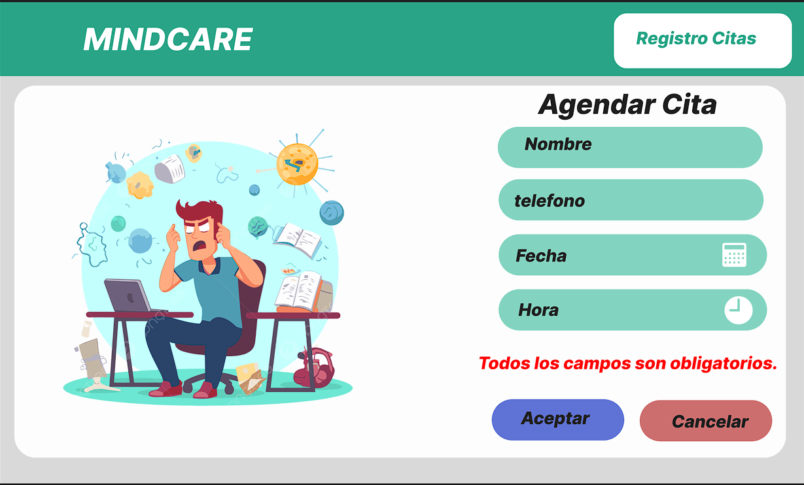

## Descripción del Proyecto
# MindCare

MindCare es una aplicación web para agendar y gestionar citas. Este proyecto está construido con React y utiliza React Router para la navegación entre las páginas.

## Requisitos de instalación

- Node.js
- npm (o yarn)

## Instalación

1. Clona este repositorio:
    ```sh
    git clone https://github.com/Kevinmcs7/Proyecto-Final.git
    ```
2. Navega al directorio del proyecto:
    ```sh
    cd mindcare
    ```
3. Instala las dependencias:
    ```sh
    npm install
    ```
    o si usas yarn:
    ```sh
    yarn install
    ```

## Ejecución

1. Inicia el servidor de desarrollo:
    ```sh
    npm run dev
    ```
    o si usas yarn:
    ```sh
    yarn dev
    ```
2. Abre tu navegador y ve a `http://localhost:5173`.

### Backend
1. desde la raiz 
  ```sh
  npm run dev
  ```
    
2. Te saldra 
  ```sh
  Server on port: 3000
  >>> DB is connected
  ```

3. Abre tu navegador y ve a `http://localhost:3000`.

### Estructura del Proyecto de FrontEnd

- **src**
  - **assets**: Contiene imágenes y otros recursos estáticos.
  - **components**: Componentes reutilizables de React.
  - **App.tsx**: Componente principal de la aplicación.
  - **Dashboard.tsx**: Componente para la vista del tablero de citas.
  - **main.tsx**: Punto de entrada de la aplicación.
  - **routes.tsx**: Definición de las rutas de la aplicación.
  - **index.css**: Estilos globales de la aplicación.

### Estructura del Proyecto de BackEnd
**src**
  - **`cita.controller.js`**: Define las funciones para registrar una nueva cita y obtener todas las citas.
  - **`cita.model.js`**: Define el esquema y el modelo de Mongoose para las citas.
  - **`cita.routes.js`**: Define las rutas para registrar una cita y obtener todas las citas.
  - **`config.js`**: Carga las variables de entorno y exporta la configuración de la aplicación.
  - **`db.js`**: Configura y establece la conexión con la base de datos MongoDB.
  - **app.js**: Configura la aplicación Express y carga los middlewares y las rutas.
  - **index.js**: Punto de entrada de la aplicación, arranca el servidor y conecta a la base de datos.


- **Estructura del Proyecto**

 
### Uso del Proyecto

La aplicación tiene dos vistas principales:
1. **Agendar Cita (App.tsx)**
2. **Registro de Citas (Dashboard.tsx)**

### Prototipos de la Vista

#### 1. Agendar Cita

La vista de agendar cita permite al usuario ingresar su nombre, teléfono, fecha y hora para agendar una cita. El formulario valida que todos los campos sean completados antes de enviar la solicitud al servidor.

 

#### 2. Registro de Citas

La vista de registro de citas muestra una lista de todas las citas agendadas. Cada cita muestra el nombre del cliente, teléfono, fecha y hora de la cita.



#### 3. Registro de citas Correctamente
La vista de registro de citas muestra los campos para agendar citas una vez que termines y des en aceptar mostrara un mensaje de Cita **agendada Correctamente**



#### 4. Registro de citas no llenado correctamente
La vista de registro de citas muestra los campos para agendar citas una vez que termines y oprimas el boton de aceptar pero falte algun campo por llenas mostrara el mensaje de Cita **Todos los campos son obligatorios.**



### Cómo Utilizar las Vistas

#### Agendar Cita

1. Llena todos los campos del formulario: Nombre, Teléfono, Fecha y Hora.
2. Haz clic en "Aceptar" para agendar la cita.
3. Si la cita se agenda correctamente, se mostrará un mensaje de éxito y el formulario se limpiará.
4. Si deseas cancelar la operación, haz clic en "Cancelar" para limpiar el formulario.
5. Para revisar que la cita se registro correctamente oprima el boton de Registro de citas y lo llevara a la pantalla de Dashboard 


#### Registro de Citas

1. Accede a la vista de Registro de Citas haciendo clic en "Registros de cita" en la parte superior de la pantalla de agendar cita.
2. La lista de citas se cargará automáticamente desde el servidor.
3. Cada tarjeta muestra la información de una cita.


# MindCare Backend

El backend de MindCare proporciona una API para gestionar citas. Este proyecto está construido con Node.js y Express, y utiliza MongoDB como base de datos.

## Descripción del Proyecto

El backend de MindCare proporciona una API RESTful que permite registrar nuevas citas y obtener una lista de todas las citas registradas en la base de datos.

### Uso del Proyecto

El backend de MindCare proporciona dos endpoints:

- **POST /api/Registrar**: Registra una nueva cita en la base de datos.
- **GET /api/Dashboard**: Obtiene una lista de todas las citas registradas en la base de datos.

---

### Descripción de las pruebas y cómo ejecutarlas.

### Prueba 1

La prueba que se muestra verifica que el enlace "Registrar" se renderiza correctamente en la aplicación. Se utiliza MemoryRouter para simular el entorno de enrutamiento sin necesidad de configurar un navegador completo. La prueba sigue estos pasos:

- Renderiza el componente **App** dentro de un MemoryRouter.
- Usa screen.getByText para buscar el texto "Registros de cita".
- Verifica que este texto esté presente en el documento usando toBeInTheDocument.

```tsx 
import { render, screen } from '@testing-library/react';
import { MemoryRouter } from 'react-router-dom';
import App from './App';

test('renderizar el enlace "Registrar"', () => {
  render(
    <MemoryRouter>
      <App />
    </MemoryRouter>
  );

  expect(screen.getByText('Registros de cita')).toBeInTheDocument();
});
```
Esta prueba se asegura de que el componente de la aplicación renderiza el enlace "Registros de cita" correctamente dentro del contexto del enrutador de memoria, simulado por MemoryRouter.

### Prueba 2 
Se han definido dos pruebas para el componente App:

- Renderizar el enlace "Registros de cita": Esta prueba verifica que el enlace "Registros de cita" se renderice correctamente en la aplicación.
- Enviar datos del formulario correctamente: Esta prueba simula el envío de un formulario de cita, asegurando que los datos se envíen correctamente y que se muestre un mensaje de éxito. Además, verifica que los campos del formulario se vacíen después de enviarlo.

```tsx 
import { render, screen, fireEvent, waitFor } from '@testing-library/react';
import { MemoryRouter } from 'react-router-dom';
import App from './App';

global.fetch = jest.fn(() =>
  Promise.resolve({
    ok: true,
    json: () => Promise.resolve({ message: "Cita agendada correctamente." }),
  })
) as jest.Mock;

describe('App', () => {
  it('debería renderizar el enlace "Registros de cita"', () => {
    // Código de la primera prueba
  });

  it('debería enviar datos del formulario correctamente', async () => {
    // Código de la segunda prueba
  });
});
```
Estas pruebas aseguran que la aplicación se comporte como se espera en términos de renderizado de componentes y manejo de formularios

### Prueba 3 

Se ha definido una prueba para el componente Dashboard que verifica si las citas obtenidas se renderizan correctamente en la interfaz de usuario.

- El mock de fetch se ha configurado para simular una llamada a la API que devuelve un array de objetos de citas con ciertos campos como nombre, telefono, fecha, y hora. La prueba asegura que estos datos se rendericen correctamente en la interfaz de usuario.

```tsx 
import { render, screen, waitFor } from '@testing-library/react';
import { MemoryRouter } from 'react-router-dom';
import Dashboard from './Dashboard';

// Limpiar el mock después de cada prueba
afterEach(() => {
  jest.clearAllMocks();
});

// Mock del fetch para evitar llamadas reales a la API
global.fetch = jest.fn(() =>
  Promise.resolve({
    ok: true,
    json: () => Promise.resolve([
      { nombre: 'Juan Perez', telefono: '123456789', fecha: '2024-05-28', hora: '10:30' },
      { nombre: 'Maria Gomez', telefono: '987654321', fecha: '2024-06-01', hora: '14:00' }
    ]),
  })
) as jest.Mock;

describe('Dashboard', () => {
  it('debería renderizar citas obtenidas correctamente', async () => {
    // Código de la prueba
  });
});

```
Esta prueba asegura que las citas obtenidas de la llamada simulada a la API se rendericen correctamente en la interfaz de usuario del componente Dashboard. Asegúrate de adaptar el código de la prueba según la estructura de tu proyecto y la lógica de tu aplicación

### Como Ejecutarlas
Ejecutar en la terminal
 ```sh
    cd mindcare
    npm test
```

¡Disfruta utilizando MindCare para gestionar tus citas de manera eficiente y organizada!

Este proyecto está diseñado para ser una solución simple y eficaz para la gestión de citas, proporcionando una interfaz de usuario clara y funcional.